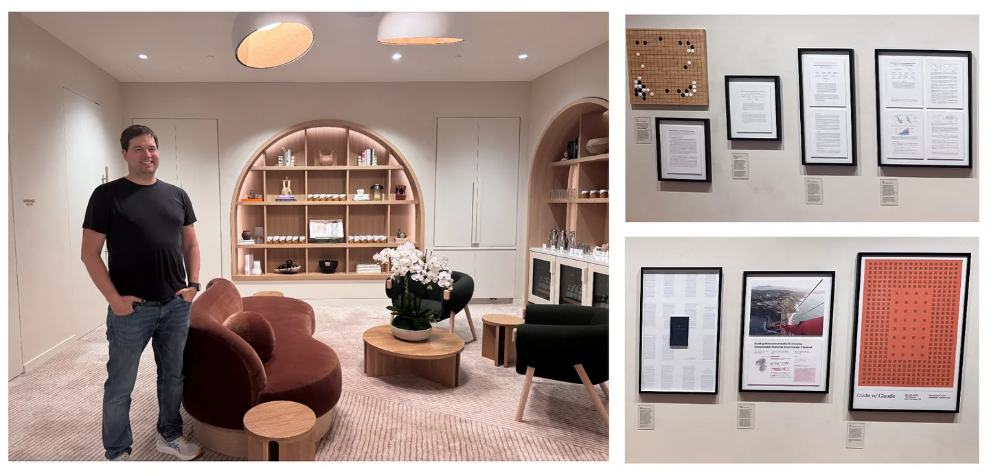
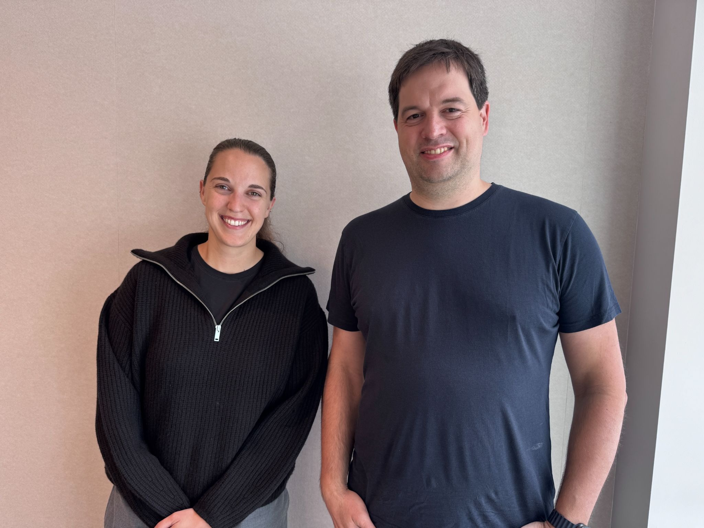
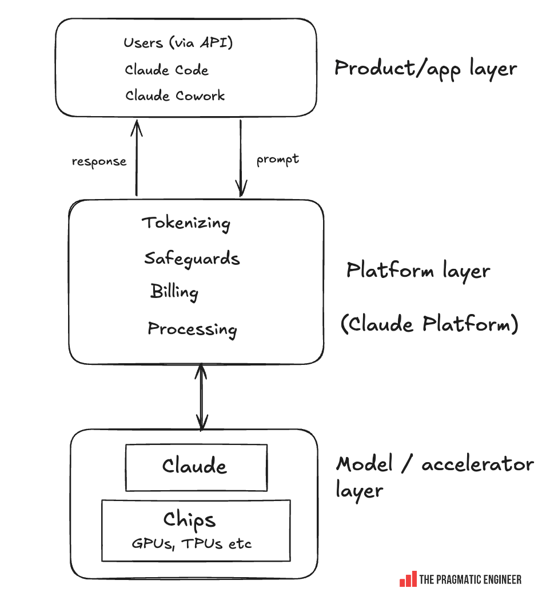
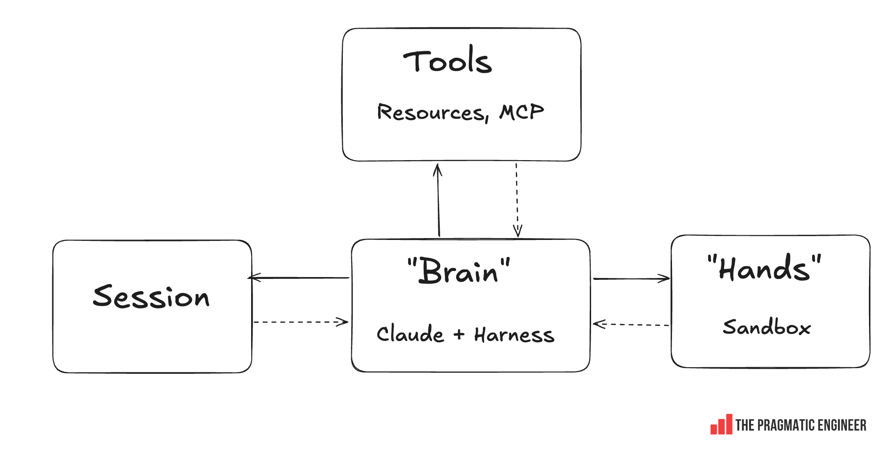
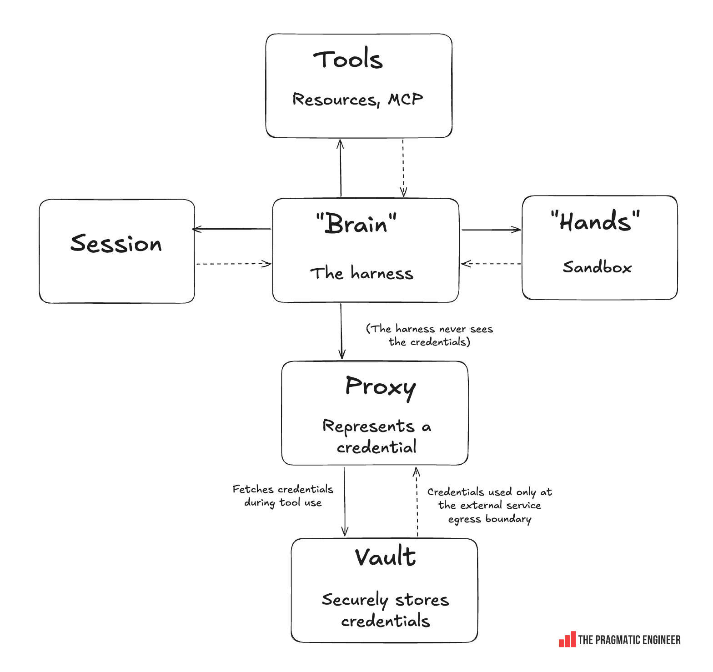
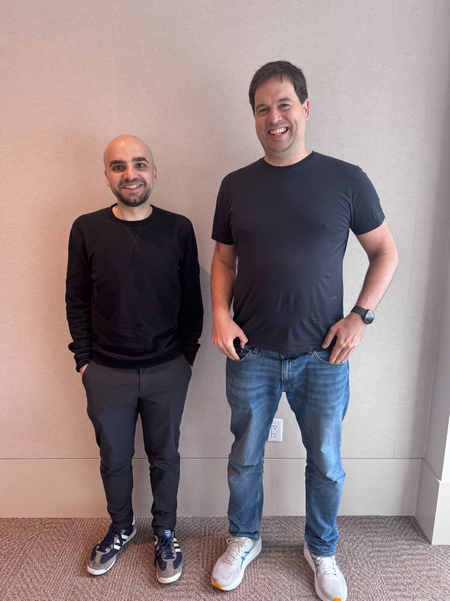
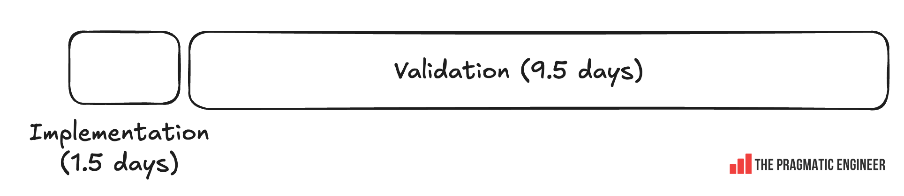
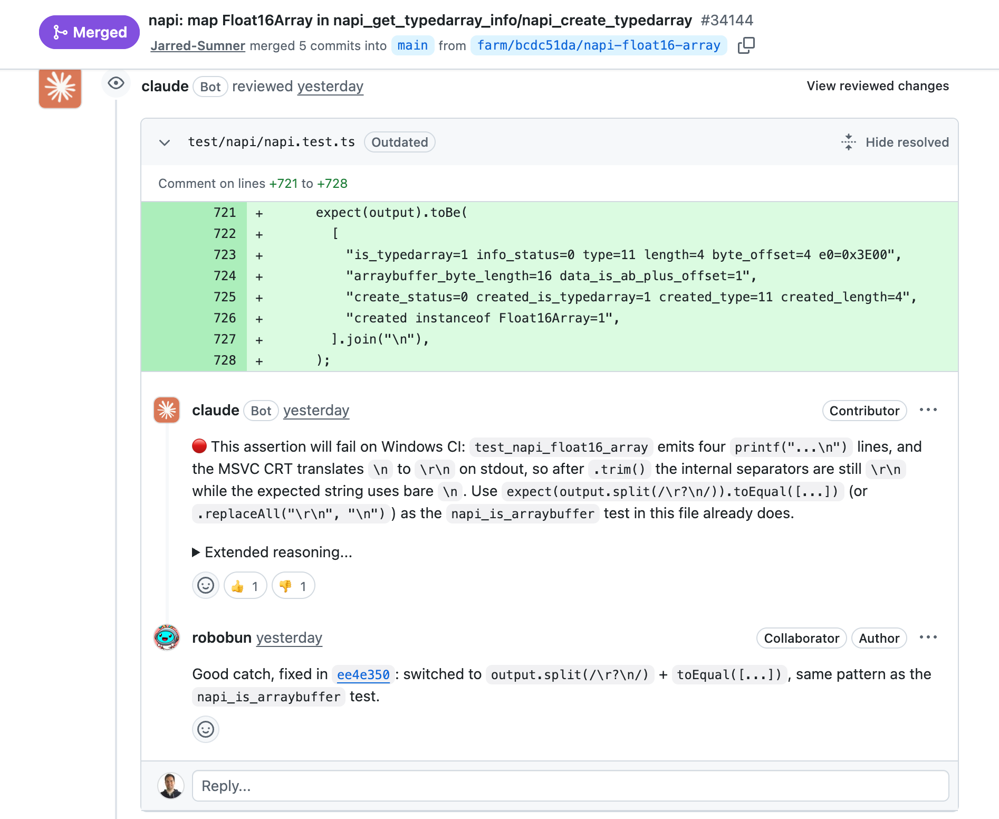

# Anthropic 内部：AI 如何改变软件构建方式

> 深入探讨这家领先的 AI 实验室在软件开发方式上发生了哪些变化。越来越多的代码审查和测试由 AI 完成，two-pizza 团队依然活跃。来自 Anthropic 内部的细节。
>
> 原文作者：[Gergely Orosz](https://newsletter.pragmaticengineer.com/p/inside-anthropic)
> 发表日期：2026 年 7 月 28 日
> 来源：[The Pragmatic Engineer](https://newsletter.pragmaticengineer.com/)

AI 工具的大幅改进正在改变我们构建软件的方式，我想窥探一下软件工程未来可能的发展方向。最好的观察地点莫过于科技领域最"AI 至上"的团队：AI 实验室本身。

因此，我走访了两家领先的 AI 实验室，了解团队和工程师的日常工作方式。在本文及后续的跟进文章中，我将分享我学到的内容——AI 如何重塑我们习以为常的软件工程原则，以及在 AI 浪潮下哪些基本没变。

在后续文章中，我们将对比 Anthropic 和 OpenAI 的发现，探讨他们的工作方式对整个软件工程发展方向意味着什么。

*Anthropic 总部内部（左）。墙上展示着 AI 发展里程碑（右）*

感谢 Anthropic 带我参观他们在旧金山的实验室。我与四位人士进行了交流：

- **Katelyn Lesse**，Claude Platform 工程负责人，其团队负责 Claude 运行的基础设施
- **Jarred Sumner**，Bun 的创建者，目前在 Anthropic 负责 Bun 和 Claude Code
- **Thariq Shihipar**，横跨 Claude Code 工程和教育领域工作
- **David Hershey**，在 Anthropic 应用 AI 组织工作，角色类似售前工程师，服务 Cursor、Cognition 和 Perplexity 等客户

感谢他们，我对这家领先 AI 实验室的发展方向有了大致的了解——可能也是整个行业的方向。

在继续之前，The Pragmatic Engineer 将在接下来的一周半放暑假。这意味着本周没有周四文章，下周也没有文章。感谢理解和支持！

今天的深度探讨涵盖以下内容：

1. **复杂且漫长：Claude Managed Agents**。最复杂的项目之一，Claude Platform 团队花了六个月时间交付，并在 Agent 基础设施层面创建了一个新的原语。基础设施项目仍然需要中途重新架构，需要时间才能做好。
2. **十二个月的项目 11 天完成：Bun 重写为 Rust**。将 50 万行以上的项目迁移到另一种语言，以前需要一个小团队花一年时间，几乎不可行。借助 Fable 和 16.5 万美元的 token 花费，项目创建者最近不到两周就完成了。
3. **工程实践的变化**。在一家拥有超过 3,500 名员工的 AI 实验室里，原型设计更加流畅，验证比实现更耗时，代码审查和测试越来越多地由 AI 完成。
4. **团队层面的变化**。设计更加持续而非前置，团队同时参与更多项目，每个项目最多两名工程师，等等。
5. **不变的：** two-pizza 团队，规划很重要，PRD 在复杂项目中仍然相关，上下文切换是挑战，编码与测试的时间比例没有太大变化。
6. **"杰出"软件工程师原型正在改变？** 深入理解（包括对工作层面以下的理解）以及协调能力变得更有价值。
7. **AI 会取代软件工程吗？** 越深入使用 AI 的工程师，越不担心自己的工作会消失。

---

## 1. 复杂且漫长：Claude Managed Agents

Claude Platform 团队过去一年最复杂的项目是构建 Claude Managed Agents——一个面向生产环境 Agent 的预构建 harness，可以在 Anthropic 管理的云基础设施上运行，也可以在你团队自己的基础设施上运行，支持你选择的任何沙箱。从构想到 4 月发布，项目耗时约六个月。Claude Platform 工程负责人 Katelyn Lesse 分享了这个故事。

*与 Katelyn Lesse 在 Anthropic*

### Claude Platform

这个团队位于模型/加速器层（Claude 模型运行在 GPU 上）和产品/应用层（包含 Claude Code 和 Claude Cowork 等产品）之间：

*Claude Platform 在 Anthropic 中的位置*

Katelyn 这样描述 Platform 团队的工作：

> "我们处于'token 热点路径'上。提示词进来后，我们对其进行分词。然后，安全护栏和计费等都在我们的层内完成。"

*Claude 团队称之为"Platform"，我更倾向于称之为"API"。* Claude Platform 运营 API，承担 API 应有的职责。*当然，团队的工作不止于此，Claude Managed Agents 就是我们探讨的案例之一。*

**平台层正在从 Python 迁移到 Rust。** 最初，这层用 Python 编写，原因和 AI 公司的"常规"理由一样：Python 使用方便，AI 研究人员已经在用，可以快速迭代。但 Python 是单线程的，在大规模高负载 API 场景下，性能不如 Rust。

### Harness 基础设施需求

Katelyn 介绍，这个项目的缘起是因为客户想要自己的"harness 基础设施"：

> "我们最初的模型是：你可以通过 API 定义一个 Agent，再通过 API 启动与 Agent 的会话。但现实是世界真正需要的是人们在自己的基础设施上运行。所以我们开始构建自托管沙箱。
>
> 然后，我们开始听到很多客户说他们在拼凑 harness，自己搭建'harness 基础设施'，这给了我们 Claude Managed Agents 的灵感。"

### 最重要的部分：规划

在这个项目中，Katelyn 表示最大的事项就是规划：

> "有些产品可以直接进入原型阶段，但有些产品需要先做好架构设计。比如，如果我们构建一个 TypeScript CLI——这在需要构建的东西中相当简单——我们可以直接原型。但 Claude Managed Agents 需要先搞清楚我们要做什么。
>
> 当然，我们为 Managed Agents 做了一些前期原型：hack 和 spike。但原型本身更多是关于理解需求。
>
> **我们的规划过程看起来更像典型的 AI 前规划流程。** 你知道每个团队都有那种项目，每个人都会提出同一个想法的某个版本，然后大家反复讨论直到最终开始做。Managed Agents 就是我们团队的这种情况。项目启动时，我们有可追溯到两年前的想法和建议文档。

规划完成后，项目正式启动，创建了 PRD（产品需求文档）：

> "最终，是 API Agents 团队的产品经理和技术主管决定启动这个项目。我们会聚在一个房间里，过一遍方案，达成共识。但这不只是我们：我们需要与业务团队、其他云提供商和其他工程团队对齐。例如，我们在 Platform 组织内有一个沙箱团队：因此这个团队参与了 Managed Agents 的设计，因为这个产品会产生大量沙箱。
>
> **和以前一样，我们有 PRD，是 Google Doc。** 我们用 Google Doc 是因为需要协调所有相关人员。这没有改变。
>
> 同样，我和产品同事会进行产品评审。"

AI 时代之前的一些流程，比如 PRD，在复杂项目中今天仍然有用，用于让大群人达成共识。

### 先为内部客户构建

规划完成后，团队决定做一次"spike"，通过在 Web 上构建 Claude Code 的后端来压力测试想法和架构。使用 Agent harness 远程执行代码与他们想为客户解决的问题形状相似。思路是先为 Claude Code 团队解决，然后再以更通用的方式为客户处理。

**AI 时代内部团队协作更加流畅。** Katelyn：

> "AI 之前，我们可能会拿着一堆大需求文档去找 Claude Code 团队，他们也会回给我们另一套文档。现在容易多了：我们团队的某个人构建了一些组件，拿到 Claude Code 团队那边，他们就开始围绕它 hack。我们可以搞清楚这个组件如何插入他们产品的哪个部分，反过来也一样。让这个第一个内部版本上线运行的过程更快更容易。
>
> 与其他团队在接口上的对齐仍然很重要，而且变得更容易了。过去，你必须带着完全规格化的接口来用。现在，我们可以更流畅地做：可以先启动一个影子流量的 stub 服务，然后在与 Claude Code 团队的协作中逐步打磨接口。他们 hack 后给反馈，我们在接口下构建服务时做调整，然后再回头让它跑起来。"

他们为 Claude Code 的移动应用启动了服务来创建沙箱、启动 Claude Code 并运行。服务上线后，Claude Platform 团队从中获得了经验。

### 中途重新架构

很多工程师都能共鸣的一个熟悉场景：规划好项目开始推进后，你发现需要改变架构。这个项目也发生了同样的事。

**Platform 团队基于 Claude Code "spike"的经验，最终重新架构了 Managed Agents。** 重新架构意味着将 Claude 的"大脑"和 harness 与"双手"（执行动作的沙箱和工具）及"会话"（事件日志）解耦。每个部分都变成了对彼此假设很少的接口。

*重新架构后 Claude Managed Agents 的高层架构*

团队还围绕 vault 和凭证构建了抽象。凭证可以安全地存储在 vault 中。所有使用凭证的调用都通过一个拥有会话令牌的代理进行。代理从 vault 获取正确的凭证：Agent、沙箱或会话永远看不到凭证。凭证只在服务调用时的出口边界注入：

*Harness 永远看不到的凭证注入*

内部"dogfooding"帮助发现了需要解决的难题。例如：

- 可靠性和可扩展性：对 Agent 来说真的很难做好，因为如果与沙箱的连接丢失，整个 Agent 就会死掉，你会丢失状态
- 凭证和访问控制：也很困难，尤其是在最初构建服务时

**项目耗时约六个月，绝非一个快速的过程。** Katelyn 强调，在 AI 之前，这样的项目可能需要大约两年时间。Managed Agents 是 Claude Platform 团队构建的最大的项目之一，比看起来更复杂：例如，添加对 AWS、GCP 和 Azure 上运行 Agent 的支持。

---

## 2. 十二个月的项目 11 天完成：Bun 重写为 Rust

如前所述，Jarred Sumner 是 Bun 的创建者，Bun 是一个流行的 JavaScript 运行时，目前月下载量 2200 万次，Claude Code 也将其作为依赖。

*与 Bun 创建者 Jarred Sumner（左）*

Bun 用 Zig 编写，这是一种高性能、高产出的语言。但它不是内存安全的，内存问题不断出现。Jarred 认为将项目重写为同样高性能且内存安全的 Rust 可能是一个选择——但过去的经验表明这类重写往往是愚蠢的。Jarred 说（强调为原文所加）：

> "历史上，重写是一个糟糕的主意。不包括注释，Bun 有 535,496 行 Zig 代码。用另一种语言重写需要一小群工程师花一整年时间。这意味着在这段时间里冻结 bug 修复、安全修复或功能开发。最安全的可交付方式是从 Zig 机械地移植到 Rust，尽可能少地改变行为，使用我们已经用于测试 Bun 的完全相同的测试套件。
>
> 幸运的是，Bun 自己的测试套件是用 TypeScript 编写的，这意味着它不依赖运行时的编程语言。
>
> **一年零面向用户的影响是我们无法考虑的选项。** 因此，通过代码风格来修复稳定性问题是我们最好的选择，也是我们在 Bun 代码库中添加受 Rust 启发的智能指针时的计划。
>
> 但说实话，我不想这样做。自制的智能指针比 Rust 的人体工程学更差，而且没有任何保证。"

但后来，Jarred 问 AI 能否承担繁重的工作，并想知道迁移能加速多少。**最终，他使用 64 个并行 Agent 和 165,000 美元的 token（按 API 价格），从开始到合并仅用 11 天完成了重写。** Jarred 这样比较他的 AI 密集型重写：

> "手动做的话，我认为这需要三个对代码库有完整上下文的工程师花大约一年时间，在此期间我们无法改善 Node.js 兼容性、修复 bug、修复安全问题或实现新功能。我们永远不会那样做。现实的选择是什么都不做，永远修复这篇帖子开头提到的 bug。"

这个项目远不止输入"...不要犯错"的提示词那么简单：

- Jarred 制定了详细的迁移计划和风格指南
- 他设置项目让 Agent 不使用他认为很慢的 Git worktree，而是在同一代码库中处理不同文件
- 他创建了一个编排系统，每个 AI Agent 提出修改建议但不直接修改文件以避免冲突；一个编排 AI Agent 负责创建提交
- 最多的时间和 token 花在了修复编译 bug、测试和验证上
- Bun 本身有一个非常健壮的测试 harness：当所有测试通过时，这是一个高置信度的信号，表明重写成功
- 至关重要的是，Jarred 是 Bun 的终极领域专家：他创建了项目，比任何人都了解代码库

重写已交付生产环境，今天支撑着 Claude Code 运行。

*我们在 [What can we learn from Bun's rapid Rust rewrite with AI?](https://blog.pragmaticengineer.com/the-pulse-what-can-we-learn-from-buns-rapid-rust-rewrite-with-ai/) 中对此有更多讨论。*

---

## 3. 工程实践的变化

那么，与 AI 之前的时代相比，Anthropic 团队构建软件的方式发生了哪些变化？这是本文要回答的问题，看起来很多事情都不同了。让我们来逐一看看：

### AI 实验室特有的实践

在 Anthropic 等 AI 实验室里，一些像呼吸一样平常的事情从外部视角看却很不同：

- **每个人都在持续运行多个 AI Agent。** 同时运行 3-10 个并行 Agent 是常态。我交流的人都有 Agent 在后台或云端运行。
- **没有 token 预算，使用量不跟踪。** AI 实验室与其他人之间的一个重大区别是*真的*没有 token 限制，也没有推动"token 最大化"的排行榜；人们已经一直在使用 Agent。
- **非常高的自主性。** AI 实验室内部的工作变得更加结构化，但与大型科技公司和大多数初创公司相比，仍然有巨大的自主权。当每个人都有无限 token 时，原型化任何想法都很容易。

### 原型设计和"spike"更加流畅

Claude Managed Agents 的原型设计速度比以前快了好几倍。Katelyn 告诉我，Claude Code 移动后端实现的"spike"也比 AI 之前快得多。

### 验证比实现更耗时

Jarred 在他的 11 天 Rust 重写中提出了实现与验证之间的时间分配问题。大致是这样的：

*Rust 重写的实现花费的时间远少于修复和验证其工作是否符合预期*

将代码从 Zig 重写为 Rust 的"实现"部分只花了约 15% 的时间，而 85% 花在了修复上：让代码编译通过、修复测试、验证它能正常工作。

### 大多数 token 不再花在实现上

**Thariq：**

> "我们看到很少有 token 花在实际上。大多数花在了发现未知事物、原型设计、mock 以及验证和测试上。"

Jarred 的 Bun 重写印证了这一点：他在修复实现和验证方面花的 token 比实现本身还多！

### AI 进行代码审查和更多测试

Jarred：

> "用 Agent 审查代码和测试是我们越来越多采用的新方法。当你合并大量代码时，我非常关注信任问题。你如何每天合并 100 多个 PR，并确保代码有效？在这个速度下，你需要信任代码，但又无法自己全部读完。我认为这涉及几个方面：
>
> - **代码审查**：需要非常好且自动化。我显然是在自卖自夸，但我发现 Claude 的代码审查真的很好。Claude 的代码审查能发现那些我需要花一个小时仔细阅读代码才能找到的 bug。缺点是它很贵！
> - **安全扫描**：这次 Rust 重写我们跑了 11 次 Claude Security Scanner。
> - **模糊测试**：我们还在做不同类型的模糊测试（fuzz testing），让 Claude 为解析器模糊测试等编写 fuzzer。
>
> 在编码之外的不同进程/会话中运行测试，是建立代码信任的一种方式。我预计这种做法会更多。"

### 新模式：将工作扇出给 AI

Jarred 描述了他的一种新工作方式：

> "我正在使用的一种新方法是将大量工作同时扇出给多个 Claude。我在 Bun 重写中这样做了，其他工作也在用。这种方法对我来说效果很好，我觉得它被严重低估了。"

### Agent 驱动的省时自动化更加普及

Jarred 列举了 Bun 团队设置的几个省时自动化，用于用一个小团队运营一个活跃的开源项目，同时团队还在做 Claude Code：

- 每次有人提交 issue，Claude 就会尝试复现问题。如果成功，它会启动另一个容器，然后尝试修复问题并提交 PR
- 负责提交 PR 的 Agent 必须编写一个在系统版本（无补丁版本）的 Bun 中失败、在带补丁的调试版本中通过的测试，才被允许提交 PR
- 还有其他自动化，比如没有测试 PR 会被自动拒绝；运行所有 linter：Claude 代码审查运行，CodeRabbit 的代码审查运行，Agent 在 GitHub pull request 上来回交流

### Pull Request 自动合并：即将到来？

当所有质量门禁通过后，PR 目前是手动合并的，但这在未来可能会变成自动化的。一旦上述所有检查通过、所有 AI 代码审查意见被解决、新代码添加了测试等。有趣的是，很多 GitHub 活动其实是 Claude 在和 Claude 对话！

*Claude 与 Claude 对话。来源：Bun GitHub*

但对于低风险情况，手动合并可能会消失，至少在 Bun 项目中是这样。Jarred 告诉我：

> "今天是人按'合并'按钮，但几个月内，我预计：
> - 自动化审查者 LGTM
> - → 另一个 Claude 用新的上下文窗口判断是否简单且低风险
> - → 如果是：自动合并！"

### 每一代模型都要重新检验假设

在 Anthropic 内部，团队不断检验他们的先验假设。Thariq 给了一个有趣的例子：

> "Agent 的问题是你必须重新审视你做的任何假设，因为它可能随着新一代模型而改变。因此，我们最近删除了 Claude Code 系统提示词的 80%，因为模型变得更聪明了。
>
> **使用 HTML 是另一个我们需要重新审视的假设。** HTML 是 Claude 比我们很多人预期的要擅长得多的东西之一。我开始更喜欢用 HTML 而不是 Markdown 作为输出格式，并看到 Claude Code 团队的其他人也在这样用。
>
> 与 Markdown 相比，HTML 可以传达更丰富的信息，HTML 文档更容易阅读和分享。"

---

## 4. 团队层面的变化

在 Anthropic，工程团队的运营方式与 AI 之前相比也有变化。

### 设计更少前置、更多持续——在产品团队中

Katelyn：

> "作为工程师，你过去可以说，'这是一个完美的、漂亮的设计。'在 Anthropic 组织内的一些团队中，前置规划已经消失了。Anthropic 组织的某些部分，人们会说类似'我们不写 PRD'或'我们不再写技术设计文档'的话。那些团队直接进入原型阶段。"

值得注意的是平台团队和产品团队之间的区别，以及产品的成熟度。产品越像平台、越成熟，前置规划的价值就越高。

### 不再担心孤岛

Katelyn 确认，虽然平台团队的典型规模没有太大变化——仍然是 6-8 人——但现在，他们承担的项目比过去多得多。

AI 之前，如果一个团队同时参与多个项目，成员会抱怨感觉被"孤岛化"：与团队中其他人正在做的事情隔绝。但现在，6-8 人的团队同时参与 3-8 个并行项目是常态。

### 单个项目最多两名工程师

Katelyn：

> "在一个单独的项目上，你通常不能有超过两个人在工作。
>
> 这是因为每个工程师已经在运行多个 Agent。所以作为一个工程师，你已经在与你的 Agent 作斗争，它们在实现上互相踩脚。在这种设置下，你不能有太多人类，他们也各自带着自己的 Agent！尤其是当人类在做系统实际设计的时候。"

Katelyn 说得有道理：在 AI 之前，在一个项目上有多个技术负责人也是灾难的配方！

### 内部团队迭代更快

AI 之前，团队通过使用设计文档来回迭代实现。现在，对于 Claude Managed Agents 项目，它变成了 Claude Code 团队围绕实现进行 hack。Katelyn 告诉我，整个过程比 AI 工具之前感觉更快更容易。

---

## 5. 不变的

以下是我从与 Anthropic 内部人士的四次对话中总结出的软件工程中没有因 AI 而太大变化的方面。

### Two-pizza 团队

在 Platform 方面，有 6-8 人的团队，和 AI 之前平台组织中的一样。Katelyn 解释为什么这没有改变：

> "我仍然有团队负责拥有一块软件，对其进行迭代，负责 oncall，等等。虽然每个人都被 AI 加持了，但团队的规模和形态仍然相似。我们仍然有 two-pizza 团队。
>
> 团队中的每个人都需要对系统有深入的理解。他们需要理解系统的发展方向，然后编排他们的 Claude 朝那个方向构建。但人们仍然需要内化他们的系统是如何工作的。所以，他们工作的系统不能大到没人能理解。
>
> 但然后，你也需要足够的人手，这样当有人在 oncall，另一个在休假，有人生病了，你仍然有冗余，团队可以继续推进。
>
> 我听到有些人说'我们有两个人类和一堆 Agent。'我回答这不是我们的现状：我们仍然有平均 6-8 人的团队。"

### 规划仍然重要

Katelyn 和 Jarred 都提到了规划的重要性，但侧重点不同：

对于 Managed Agents，由于复杂性，规划过程最接近 AI 之前的方式：

- **基础设施复杂性**：平台本身很复杂，有很多需要考虑的部分
- **涉及的人员/团队众多**：需要大量人员和团队对齐，不仅是 Platform 团队，还有 Anthropic 其他团队，以及与三家不同的云提供商合作

这需要时间才能做好！

对于 Bun 重写，Jarred 花了三个小时与 Claude 讨论如何将 Zig 代码库的模式紧密映射到 Rust。

对于涉及多人或多系统的复杂项目，规划在 Anthropic 仍然重要。即使是启动一个"更简单"的迁移项目，几个小时的密集准备和规划也被认为是值得的。

也不要忘记，在 Bun 重写中，规划部分因 Jarred 作为创建者和事实上的领域专家而大大缩短。而且没有其他工程师参与，进一步缩短了流程。

### 某些团队中的 PRD

PRD 用于需要协调大量人员的情况，Claude Managed Agents 项目就是一个好例子。Anthropic 内部的 PRD 是 Google Doc，因为这个文档的目的是被辩论，并就复杂项目的高层目标和设计方法达成一致。

### 平台/产品划分与原型/成熟产品划分

构建产品和构建系统之间有很大区别，系统的前期设计远比产品多。

对于产品，需要考虑成熟度。例如，Claude Code 在初期更像是一个原型。然后它找到了产品市场契合点，今天它是一个拥有数百万客户的成熟产品。原型化是产品起步的好方法。但产品越成熟，对于需要与产品其他部分良好集成的新功能或产品级变更，就越需要规划。

AI 之前也是如此；我们在 [Uber 如何引入平台和产品团队（2014 年）](https://newsletter.pragmaticengineer.com/) 中讨论过，那是第一篇 Pragmatic Engineer 文章。

### 平台工作依然充满挑战

Katelyn 又说：

> "应用开发和平台开发之间有不同的工作文化。例如，当我们将新事物构建到平台中时，我们会在三个云（AWS、GCP、Azure）上部署，并在多个区域部署。我们最终将开始在国际范围部署。这带来了很多复杂性。
>
> 我们在组织内有专门的团队，每一层都有专家团队。我们有抽象层，所以大多数人不需要考虑物理基础设施。但即使如此，在我的组织里，我有一个团队了解每个不同云上的队列实现是什么样的。在某些情况下，我们运行裸机，在其他情况下运行托管服务。我们始终有一个团队了解每一层的每个部分，然后其他团队不需要在给定的层中变得如此专业。"

### 上下文切换仍然困难

我问 Katelyn，现在让另一个团队的工程师帮助你自己的工作是否变得更容易了。我以为当每个人都使用 AI 时，在帮助他人后回到"心流"状态应该更容易。Katelyn 不这么认为：

> "上下文切换一方面变得更容易了，但仍然非常困难。过去，去找一个正在做深度工作的工程师，请他们停下来帮助你做反馈或做一些工作，是一个很大的请求。有了 AI，上下文切换变得更容易，但深度工作并没有消失。"

### 跨团队工程中的接口约定仍然重要

回顾 Claude Managed Agents，Katelyn 告诉我定义 Platform 团队构建的 Managed Agents 和使用它的 Claude Code 团队之间的接口仍然很重要，和 AI 之前一样。不同的是，用 AI 迭代变得更容易：

> "过去，你必须带着完全规格化的接口去找你要集成的团队（对我们来说是 Claude Code）。现在，我们可以更流畅地做：可以先启动一个影子流量的 stub 服务，然后在与 Claude Code 团队的协作中逐步打磨接口。他们 hack 后给反馈，我们做调整——我们在接口下构建服务——让它跑起来。"

### 编码/测试时间比例没有变化

Jarred 表示，AI 出现前后，花在编码和测试上的时间比例没有太大变化：

> "AI 编写了几乎所有的代码，但我们也让 AI 编写几乎所有的测试。在 AI 之前，对于生产就绪的软件，我们花在写测试上的时间大约与写代码的时间相同。AI 出现后仍然如此。你需要有一种信任代码的方式，测试可能是最好的方式。"

AI 节省了写代码和测试的时间，这些时间去哪了？Jarred 说他现在没有更多空闲时间：

> "我现在花更多时间确保一切正常工作，做比以前更多的事情。Bun 中有很多东西是 [AI 节省的时间] 之前无法交付的。例如，我们在 Bun 上有一个 Markdown 解析器和一个 YAML 解析器。我以前有一个我想在 Bun 中做的所有事情的清单，现在几乎全都有了！
>
> 过去的瓶颈是我或其他人花大量时间写代码，然后花同样多的时间想办法测试它和构建什么测试套件。但现在，我们只需在 Slack 中 @Claude（使用 Claude Tag），它就会运行并给我们一个 PR 作为起点。"

### 学习新东西才能做出好东西

Thariq Shihipar 负责 Claude Code 的大部分教育内容。他是一位经常 tinkering 并分享所学的软件工程师；例如，他如何让 Fable 编辑一个发布视频。他也与 Claude Code 团队和 Anthropic 外部的工程师合作。

Thariq 认为工程中不变的一点是：要做出真正出色的东西需要特别的努力。他告诉我：

> "当你思考如何做出出色的东西时，通常需要学习新东西。比如你想做一个视频游戏。人们喜欢 vibe coding 视频游戏，但要做出一个真正好的游戏有太多东西要学！
>
> 例如，如果你在做一个控制飞机的飞行游戏，飞机对左右移动的反应有很多深度。如果你了解这个领域，Claude 可以和你一起工作。但根据我的观察，你需要扩展自己的知识才能有效地与 AI 合作，得到感觉'出色'的最终结果。"

---

## 6. "杰出"软件工程师原型正在改变？

我问 Katelyn 和 Jarred，"杰出"软件工程师原型是否随着 AI 工具的采用而改变，以及在他们看来哪些特质造就了一个优秀的工程师。

### 理解、理解、再理解

Jarred：

> "理解一切如何端到端工作仍然非常重要。同样，重要的是不要因为是假设的东西就认为它仍然成立。
>
> 很多编程仍然是摸索和观察结果。所以，在头脑中保持心智模型并保持主导。作为一个人，我仍然在决定合并什么，以及我应该做什么。我仍然非常挑剔它应该完成的方式，这来自理解。我认为你也可以用 AI 来帮助你更快地理解。"

Katelyn 说了类似的：

> "理解是优秀工程师的基本功。确保你不仅理解 LLM 做了什么，还要理解它下面的一层。
>
> 模型的问题是上下文窗口是有限的。我们的研究团队正在非常努力地工作，让模型感觉拥有几乎无限的上下文，让它能做出正确的决策并将它们存储在记忆中，然后取回，并尽可能保持上下文窗口的清洁。但最终，模型的上下文窗口是有限的，远不及人脑能存储的——所以在与 Agent 工作的同时，继续投资发展自己的心智。与模型一起理解和学习的这种方式很好。"

Katelyn 强调，作为工程师，不仅要理解当前层，还要理解下面一层。例如，如果构建使用队列的产品，要理解你使用的队列原语或实现。

### 协调能力也是基本功

Katelyn：

> "协调和对齐对工程师来说仍然是非常重要的技能。即使 AI 工具让协调人群变得更容易，这也不会消失！"

我补充自己的观察：我在 Anthropic 遇到的每一位工程师都是优秀的沟通者，能够清晰表达他们的想法。我怀疑公司不会雇佣缺乏这种能力和辩论想法能力的人。

### 工程师设计软件

Katelyn：

> "工程师是做设计的人，这种情况可能还会持续一段时间。即使模型在技术设计和系统设计方面越来越好，我也看不到模型在大规模分布式系统设计上取代我的工程师。"

将模型引导到正确方向非常重要。又一个需要理解模型做了什么——以及它下面一层——的原因：模型必然会出错。当它出错时，你希望引导模型纠正。

### "心流"状态已经改变

Jarred 在 AI 之前是一位杰出的程序员，花了很多时间"专注"写代码。现在 AI 编写了他的大部分代码，我问他是否还能进入"心流"状态。他告诉我：

> "作为开发者的'心流'现在确实不同了。我仍然会按顺序做事，有时。不是写代码，而是当你做一个项目时，有很多事情在发生，你看到它一步步组合起来。只要反馈循环足够快，我就会发现自己进入了一种'心流'。说实话，这与'编码'心流不同，但真的很有趣。
>
> 另一件我喜欢的事情是，我可以离开电脑，事情仍在发生。例如，我可以在跑步时查看后台运行的 Agent 进展如何。"

---

## 7. AI 会取代软件工程吗？

2025 年 2 月，Anthropic CEO Dario Amodei 发表了一个引人注目的预测："编码正在消失，然后是所有的软件工程"。他的评论：

> "我认为编码会先消失，由 AI 模型先完成。而软件工程的更广泛任务会花更长时间。端到端 [AI 取代软件工程] 也会发生。
>
> 但设计的元素，或者做出对用户有用的东西，或者管理 AI 模型团队：这些可能仍然存在。即使你只做一个任务的 5%，那 5% 也会被超级放大。"

我问 Katelyn、Jarred 和 David Hershey 的看法：他们是否看到软件工程正在"消失"并被 Claude "解决"？有趣的是，每天构建软件的人并不担心模型会接管软件工程。Katelyn 和 Jarred 确信他们有很多工作要做，感觉自己比以前更忙于软件工程！

他们做大量规划、协调、验证、想出更有效的 Agent 管理方式，以及构建新软件。

David Hershey 侧重于客户，他认为模型最终会接管软件工程：

> "我很难相信模型最终不会接管我们称为软件工程的这个东西。它在几乎所有方面都会比我们做得更好。
>
> 模型已经可以倾听客户反馈，并编写软件来解决客户的问题。很难指出它做不到的事情。
>
> 我见证了模型成为比我更好的软件工程师，而我有一个软件工程学位。我不认为自己是伟大的软件工程师，但我不明白为什么它会停在我的水平而不再继续超越大多数软件工程师。"

根据我的小样本，越深入参与软件工程的人，越不认为模型会抢走他们的工作。Katelyn 和 Jarred 都强调了理解系统的一切、它如何工作的重要性，以及在理解的道路上不断深入——尤其是在 AI 的帮助下！

### Takeaways

在 Anthropic 的一天很有趣，之后有很多关于软件工程变化方式和未来方向的思考。非常感谢那里所有人的接待和分享时间。

我怀疑 Anthropic 内部的软件工程方式将是许多"AI 原生"初创公司很快运营的方式——如果不是已经这样的话。具体来说：

- 最多两名工程师和一堆 AI Agent 完成项目
- 设计更加持续而非前置
- 更多的原型设计，只有复杂项目才做详细规划
- ……但事情仍然需要时间，即使编码更快了！AI 并没有神奇地解决如何构建复杂的、满足客户需求的优质软件

Anthropic 的软件工程标准已经上移。我与之交谈的每位工程师在多个维度都是"杰出的"：

- **AI 之前就是优秀工程师**：这些人在 AI 浪潮之前就是非常好的工程师
- **每天推动自己**：他们用（或不用！）AI 尝试新方法，改变工作流，持续学习如何最好地使用最新模型
- **协作和协调是关键**：他们在需要时自我管理、管理利益相关者和团队

像 Anthropic 这样处于领先地位的高知名度实验室可以雇佣"最好的"软件工程师，一个问题是这对于没有 Anthropic 品牌认知度和资金的公司意味着什么。也许这种设置只有在你能雇佣到如此杰出的工程师时才有效，对于无法吸引此类杰出人才的公司，试图复制 Anthropic 的做法很可能导致失望，而没有同样积极和有能力的员工。

今天，Anthropic 的人均收入是大型科技公司的五倍。Anthropic 由大约 3,500 人组成，年化收入在今年 5 月突破了 470 亿美元。这大约是每人 1,350 万美元的收入：Meta 是每人 270 万美元，Apple 260 万美元，Google 220 万美元。NVIDIA 是唯一接近的主要公司，每人 600 万美元。

人均收入是验证 Anthropic 在一切中尽可能使用 AI 的方法的一个维度，包括软件工程。这样的收入也使他们能够继续以市场上最大的薪酬方案雇佣顶尖人才。

我们应该说明一个明显的事实：Anthropic 的业务是销售 AI 模型，所以重度使用 AI 是显而易见的。但他们也以令人惊讶的小团队支持着大量客户和企业，而比大多数公司更多地使用 AI 显然是用更少员工运营的方式之一。

然而，团队 remarkably 没有变化。Anthropic 工作方式中一个熟悉的部分是，"团队"仍然是工程组织的核心构建单元，由 6-8 名工程师组成，和 AI 之前一样。

团队被两个人和数十个 Agent 取代的情况在 Anthropic 没有发生，因为这不会促进可持续运营。正如 Katelyn 关于团队规模所说：

> "我听到有些人说'我们有两个人类和一堆 Agent。'我回答这不是我们的现状：我们仍然有平均 6-8 人的团队。"

我希望你觉得这次对 Anthropic 工作方式的观察很有趣。在未来的文章中，我将分享访问 OpenAI 办公室后从内部获得的细节，我们将有机会对比两者。
